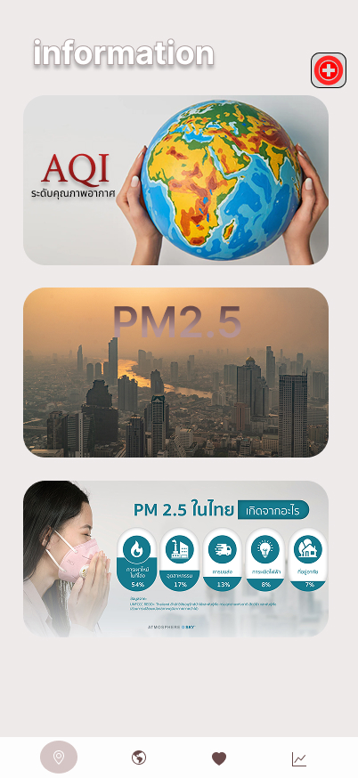
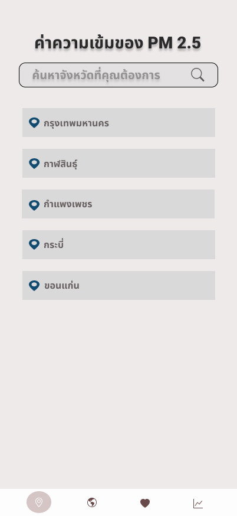

# 🌫️ PM2.5 Forecast App (Flutter)

**PM2.5 Forecast** is a mobile application developed using **Flutter (Dart)**. It displays real-time information on **PM2.5 levels**, **air quality**, and **weather conditions**. The app also provides future PM2.5 forecasts using an AI-powered **LSTM (Long Short-Term Memory)** model.

This project was developed as part of a **third-year undergraduate course (Semester 2)**.

---

## 🚀 Key Features

- 🧭 **Location-Based Station Detection** – Automatically find the nearest air quality monitoring station
- 📊 **PM2.5 Forecasting (LSTM)** – Hourly PM2.5 prediction using deep learning
- 🌦️ **Real-Time Weather** – Display temperature, humidity, rainfall, and AQI (Air Quality Index)
- 🗺️ **Interactive Map View** – View all monitoring stations on a map
- 🔍 **Station Search** – Search stations by province or name
- 💡 **Health Advice** – Provide health recommendations based on pollution levels
- 🧠 **AI Model Integration** – LSTM-based forecasting from historical data
- 📦 **Local Storage** – Store last visited station using SharedPreferences

---

## ⚙️ System Architecture

| Component             | Description |
|-----------------------|-------------|
| **📱 Flutter App**    | Cross-platform mobile app developed in Flutter and Dart |
| **🌐 Node.js Backend**| RESTful API handling real-time and forecast data |
| **🧠 AI Engine (Python)** | LSTM model for PM2.5 forecasting |
| **📡 External Data Sources** | Data from meteorological and environmental authorities (e.g., Thai Meteorological Dept, PCD, GISTDA) |

---

## 🧰 Tech Stack

### 💻 Frontend (Flutter)

- Flutter + Dart
- http, shared_preferences, google_maps_flutter, intl
- flutter_svg, bottom_navigation_bar
- State management with FutureBuilder
- GPS and real-time graph plotting
- UI designed with Figma

### 🌐 Backend

- Node.js + Express
- RESTful APIs:
  - PM2.5 levels per station
  - Health recommendation endpoints
  - Forecast data endpoints
- MySQL or PostgreSQL database

### 🧠 AI Model

- Python with TensorFlow / Keras
- Model: Long Short-Term Memory (LSTM)
- Techniques: Data Pre-processing, Normalization, Sliding Window
- Evaluation Metrics:
  - Mean Squared Error (MSE)
  - Root Mean Squared Error (RMSE)
  - Mean Absolute Error (MAE)
  - Mean Absolute Percentage Error (MAPE)

### 📖 Theoretical Foundations

- The LSTM (Long Short-Term Memory) model is used to forecast PM2.5, leveraging its ability to capture long-term time series patterns.
- Data collected from multiple sources:
  - Thai Meteorological Department
  - Pollution Control Department
  - Traffic reports (e.g., Google Traffic)
  - GISTDA spatial data

> Model training is based on historical data and evaluated using MSE, RMSE, MAE, and MAPE

---

### 🎓 Academic Context

This project demonstrates skills in:

- Mobile app development using Flutter
- Full-stack system integration with REST APIs
- Sensor and weather data processing
- Forecasting using LSTM deep learning
- Data fusion and preprocessing techniques
- UI/UX design with Figma
- Real-time interactive visualization

### 🧪 Testing & Tools

- ✅ Tested on Emulator & Physical Android Devices
- 🛠️ Visual Studio Code, Android Studio
- 📊 Power BI for data analysis and dashboarding
- 📐 Draw.io for diagrams and system design
- 💾 MySQL Server for relational data management

---

## 📸 Screenshots (Placeholder)

| Home Screen | Map Screen | Title Screen | Infomation Screen | Search Screen |
|-------------|----------------|----------------|----------------|----------------|
|  |  |  |  |  |

---
